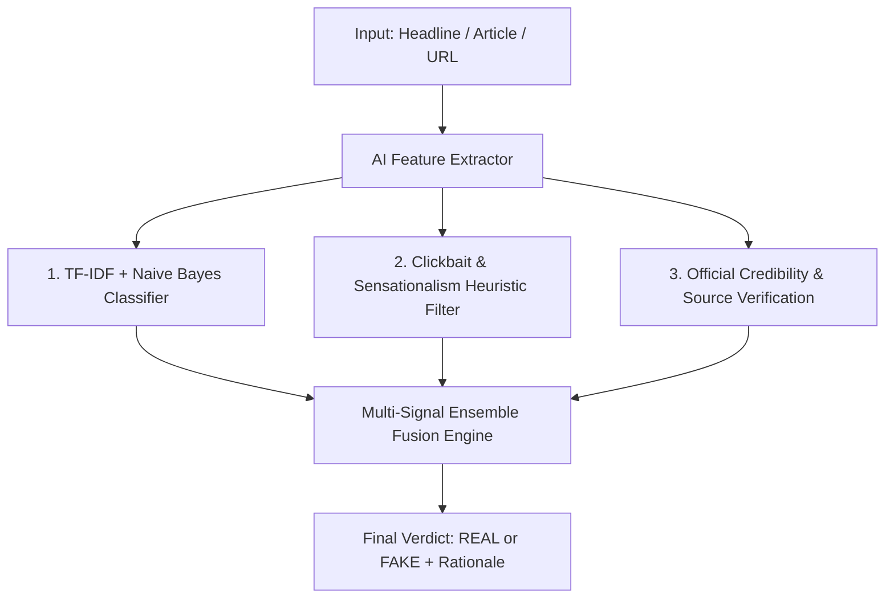

# 🛡️ Veri-News AI | Multi-Signal Fake News Detection Platform

An advanced, full-stack artificial intelligence application designed to combat digital misinformation, clickbait, and unverified rumors in real time. Powered by an **Ensemble AI Detection Engine** (Scikit-Learn Machine Learning + NLP Linguistic Heuristics + Credibility Verification) paired with a **Modern Glassmorphism React Frontend** and **Django REST Framework API**.

---

## 🌟 Key Features

* ⚡ **Instant AI News Checker (`/checkbytitle`):** Paste any news headline, full article text, or live webpage URL for instant direct verification. Displays prominent 🟢 **REAL NEWS** or 🔴 **FAKE NEWS** badges with authenticity percentage scores and plain-English AI explanations.
* 📰 **Live News Feed & Category Explorer (`/` & `/category`):** Real-time monitoring feed categorizing live articles across Technology, Politics, Science, World News, and Business with automated verification metrics.
* 🏆 **Gamified News Quiz (`/newsquiz`):** Test and improve your critical thinking skills by identifying real vs fake news headlines in an interactive quiz with streak tracking and high scores.
* 📊 **Analytics & Transparency Studio (`/analytics`):** Comprehensive breakdown of AI confidence metrics, sensationalism index scores (0–100), and detected red-flag clickbait phrases.

---

## 🧠 AI & Detection Architecture

The platform uses a **Multi-Signal Ensemble Fusion Model** to evaluate news content across three distinct layers:



1. **Machine Learning Model:** TF-IDF (Term Frequency-Inverse Document Frequency) vectorization paired with a Naive Bayes Classifier trained on news datasets.
2. **Linguistic Sensationalism Analysis:** Scans for high emotional intensity, excessive ALL-CAPS words, exclamation mark density, and red-flag clickbait keywords (e.g., *"SHOCKING SECRET"*, *"MIRACLE CURE"*, *"DOCTORS HATE"*, *"BANNED TRUTH"*).
3. **Credibility & Journalistic Sourcing:** Detects official press statements, scientific body attributions (e.g., NASA, WHO, Reuters, BBC, academic publications) to verify authentic reporting.

---

## 💻 Tech Stack

* **Frontend:** React.js, React-Bootstrap, React-Router-DOM, React-Toastify, Vanilla CSS (Glassmorphism UI Theme)
* **Backend:** Python 3, Django 4, Django REST Framework, BeautifulSoup4, Requests
* **Machine Learning / Data:** Scikit-Learn, NLTK, TF-IDF Vectorizer, Naive Bayes Classifier, Pandas, NumPy

---

## 🚀 Quick Start & Installation

### Prerequisites
* **Python 3.9+**
* **Node.js 16+** & **npm**

---

### 1. Backend Setup (Django API)

```bash
# Navigate to backend directory
cd app/FakeNewsDetectorAPI

# Install Python dependencies
pip install -r requirements.txt

# Run database migrations
python manage.py migrate

# Load initial quiz dataset
python manage.py quiz_data_loader game_data/game_data.csv

# Start Django development server
python manage.py runserver
```
> The Django backend will run at **`http://127.0.0.1:8000/`**

---

### 2. Frontend Setup (React App)

Open a new terminal window:

```bash
# Navigate to frontend directory
cd app/fake-news-detector-frontend

# Install Node.js packages
npm install

# Start React development server
npm start
```
> The React Web Application will automatically launch at **`http://localhost:3000/`**

---

## 📡 REST API Documentation

| Endpoint | Method | Description |
| :--- | :--- | :--- |
| `/api/usercheck/title/` | `POST` | Analyzes text headline or body and returns REAL/FAKE prediction & scores. |
| `/api/usercheck/title/url/` | `POST` | Scrapes web article URL and runs multi-signal verification. |
| `/api/live/` | `GET` | Returns live news stream with AI verification tags. |
| `/api/category/<category_name>/` | `GET` | Returns news articles filtered by category. |
| `/api/newsquiz/` | `GET` | Returns interactive news quiz questions. |

---

## 📄 License

Distributed under the MIT License. See `LICENSE` for more information.
